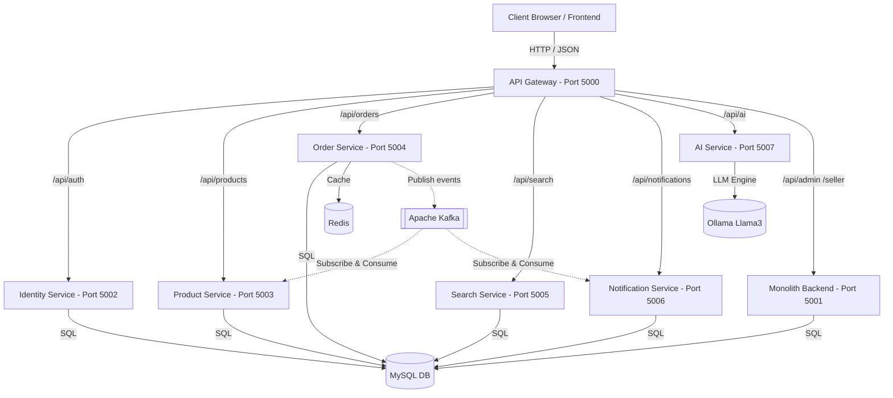

# 💎 KLYRO — Premium Commerce Experience

> *"Where Luxury Design meets Distributed Architecture & Intelligent Commerce."*

[](http://localhost:5173)
[](http://localhost:5000)
[](http://localhost:3307)
[](http://localhost:9092)

---

## 🚀 Overview

**KLYRO** is a premium, next-generation e-commerce ecosystem designed for high speed, luxury visual design, and infinite scalability. Rather than a standard monolith, it is built as a **hybrid microservices architecture** that handles high-traffic transactions, real-time event streaming, and AI-driven concierge search.

The storefront is styled with a custom cinematic UI/UX (featuring glassmorphism, smooth micro-animations, and fluid responsive layouts), creating a premium shopping experience.

---

## 🏛️ System Architecture

KLYRO is designed with a **highly scalable, event-driven microservices pattern** coupled with a monolith backend for administrative operations.



### 📡 Components & Port Map

| Component | Port | Purpose / Technologies |
| :--- | :---: | :--- |
| **`frontend`** | `5173` | React.js, TailwindCSS, Vite. Luxury-grade customer storefront. |
| **`api-gateway`** | `5000` | HTTP proxying & rate-limiting. Entrypoint for all client requests. |
| **`backend`** | `5001` | Monolith backend handling user profiles, sellers, admin panels, and uploads. |
| **`identity-service`**| `5002` | JWT-based Authentication, password hashing, user roles definition. |
| **`product-service`** | `5003` | Product catalogs, categories (Grocery, Automotive, Fashion, etc.), views, and counts. |
| **`order-service`**   | `5004` | Order placement, transactions, shopping cart, and checkout flow. |
| **`search-service`**  | `5005` | High-performance search, filtering, and indexing of products. |
| **`notification-service`** | `5006` | Real-time notifications, mocks emails/alerts on actions. |
| **`ai-service`**      | `5007` | AI Concierge Chatbot powered by Local LLM (Ollama) & search indexing. |

---

## ⚡ Technology Stack

### Front-End Hub
* **React.js & Vite** — High-speed Hot Module Replacement (HMR) and fast build execution.
* **TailwindCSS** — Curated, custom-designed dark/light luxury theme configurations.
* **Lucide React** — Minimalist vector iconography system.
* **Axios** — Centralized client instance with gateway interceptors.

### Back-End Services
* **Node.js & Express.js** — Asynchronous I/O routing for all microservices.
* **MySQL 8.0** — Relational storage with foreign constraints and optimized indexing.
* **Redis** — Fast database queries caching and session state management.
* **Apache Kafka & Zookeeper** — Asynchronous event streaming (e.g. `klyro.orders.created` triggers inventory deduction and notification dispatch in parallel).
* **Ollama (Llama3/Qwen)** — Self-hosted local LLM interface for smart search suggestions.

---

## ✨ Key Features

### 🛒 Customer Storefront
* **Premium Home & Category Pages**: High-fidelity headers, interactive product grids, and fluid motion transitions.
* **Custom Grocery Flow**: Dynamic category loading (`Fruits`, `Vegetables`, `Dairy`, `Staples`, `Snacks`) fetching products from database microservices seamlessly.
* **Smart Shopping Cart**: Real-time quantity management, live calculation, and checkout workflows.
* **AI Concierge**: Floating AI assistant panel helping users find products dynamically.

### 🛡️ Admin & Seller Panels (`/frontend-admin`, `/frontend-seller`)
* **Live Analytics Dashboards**: Visual sales charts, order counts, and registration flows.
* **Catalog Management**: Easy creation, updation, and deletion of product catalogs and inventory.
* **Seller Tools**: Independent seller registration, product uploads, order tracking, and invoice statuses.

---

## 🚀 Run Guide

### Option 1: Docker Compose (Highly Recommended - Single Command)
Ensure **Docker Desktop** is running. From the project root, run:
```bash
docker compose up --build
```
This builds and starts all services (monolith backend, gateway, all microservices, MySQL database, Kafka broker, Redis cache, and Vite frontend) in a unified virtual network.

* Access the application storefront at: **[http://localhost:5173](http://localhost:5173)**
* Access the API Gateway status check at: **[http://localhost:5000/health](http://localhost:5000/health)**

---

### Option 2: Local Run (For Development)

#### 1. Setup Database
Ensure a local instance of MySQL is running. Create a database named `klyro_db` and apply credentials inside `backend/.env`.
Run the database migrations and data seeding script inside the backend folder:
```bash
cd backend
npm install
node run-migration.js
node seed_hierarchical.js
```

#### 2. Install Dependencies
Run `npm install` inside the root, backend, frontend, and all individual services folders:
```bash
# Root dependencies
npm install

# Sub-apps installation
cd backend && npm install
cd ../frontend && npm install
cd ../frontend-seller && npm install
cd ../frontend-admin && npm install
```

#### 3. Run Development Servers
From the root directory, choose a command based on your requirements:
```bash
# Run only Frontend & Backend Monolith
npm run dev

# Run Frontend, Monolith Backend, Seller, and Admin Panels concurrently
npm run dev:all

# Run Frontend, Backend Monolith, and all Microservices concurrently
npm run dev:micro
```

---

## 📂 Project Structure

```
KLYRO/
├── backend/                       # Monolith backend API & Seeding scripts
├── frontend/                      # Client storefront application (React.js)
├── frontend-admin/                # Store Administrator dashboard
├── frontend-seller/               # Seller registration & analytics portal
├── services/                      # Microservices Hub
│   ├── ai-service/                # AI Chatbot & Ollama connection handler
│   ├── api-gateway/               # API Gateway & Reverse proxy configuration
│   ├── identity-service/          # Authentication & Authorization service
│   ├── notification-service/      # Notifications (alerts, emails) consumer
│   ├── order-service/             # Order creation & Cart management service
│   ├── product-service/           # Product categories & Listing service
│   └── search-service/            # Product search index service
├── docker-compose.yml             # Global container orchestration script
└── README.md                      # Premium system documentation
```

---

*✨ Crafted for a premium visual aesthetic and advanced enterprise-grade scalability. KLYRO — 2026.*
